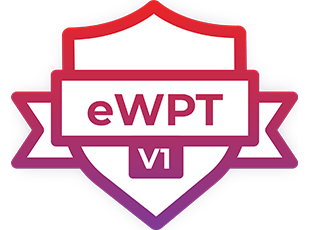

# Paweł Mazur
Software Tester, Infosec enthusiast

[LinkedIn](https://www.linkedin.com/in/ppppapwel/)
[GitHub](https://github.com/zakibro/)

<a href="pawelmazur835@gmail.com">pawelmazur835@gmail.com</a>

## Currently

Junior Tester in LIBRUS spółka z ograniczoną odpowiedzialnością sp. k. 
`Dec 2019 - now`

### Specialized in

Software testing, Test Planing, Agile Testing, Penetration Testing, Web Application Penetration Testing, Vulnerability Assessment, Linux (BTW I use Arch),
Java, Selenium, Jira, OWASP TOP 10, MySQL, PageObjectPattern, JUnit, OWASP ZAP, Information Gathering, Web Application Security Assessment, REST API, Postman

## Education

`2018-2019`
__AGH University of Science and Technology__

- PgC, Cybersecurity

`2016 - 2018`
__University of Bielsko-Biala__

- Master's degree, International Management

`2013 - 2016`
__University of Bielsko-Biala__

- Bachelor's degree, English - Language Interpretation and Translation

## Certifications

`2020`
eWPT, *eLearnSecurity* 

Credential ID, *4453787*, [Credential URL](https://verified.elearnsecurity.com/certificates/ef9d42bb-05d4-4ff6-b2b3-ffe01b1a481a) 

`2020`
eJPT, *eLearnSecurity*

Credential ID, *4261877*, [Credential URL](https://verified.elearnsecurity.com/certificates/568eb024-2975-4a17-85ea-47461abadcc4)

`2019`
Foundation Level ISTQB, *International Software Testing Qualifications Board*

Credential ID, *12990/FLCT/2019*

## Courses

`2020 - 2020`
__CodersLab__

- Automated Tester

`2019 - 2019`
__CodersLab__

- Manual Tester

### Interests

Cybersecurity, Bass Guitar, IT Books, CTFs, BugBounties

<!-- ### Footer

Last updated: Sep 2020 -->

